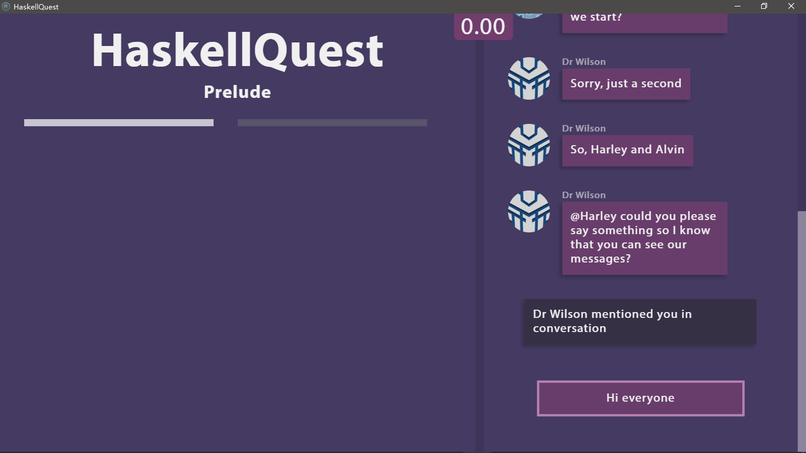
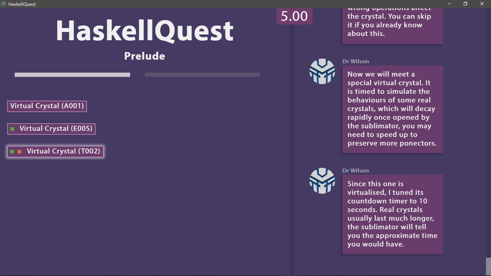
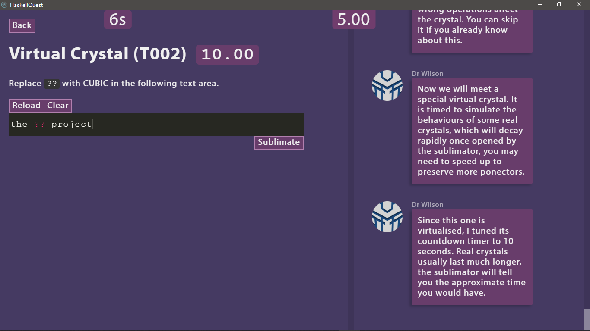
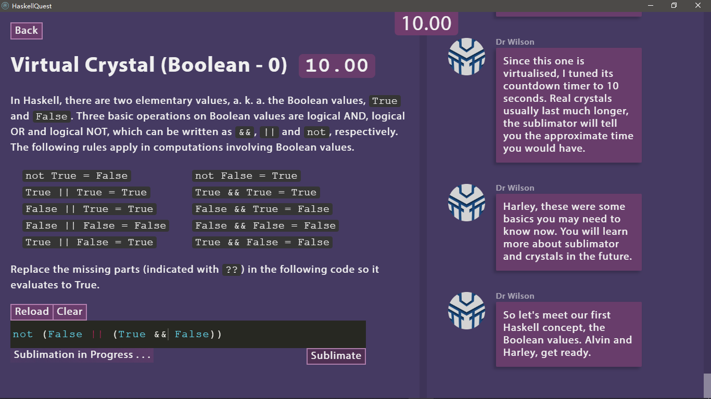
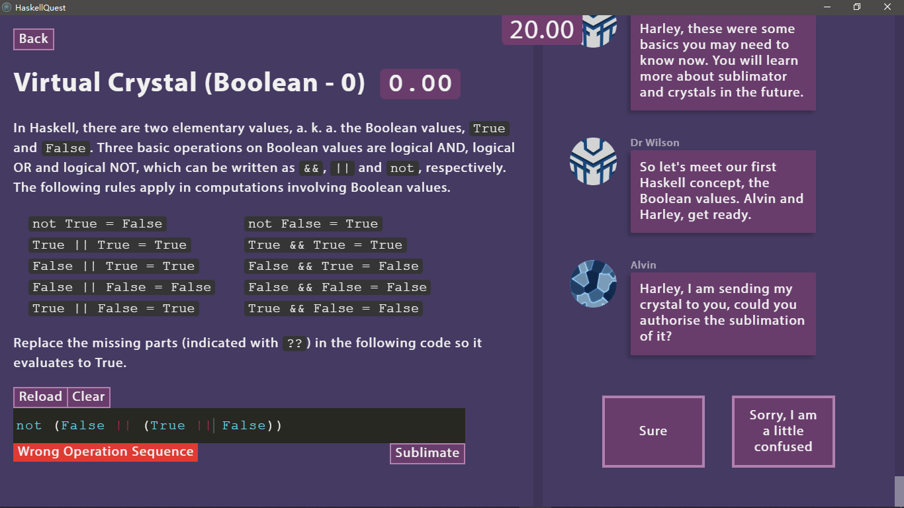
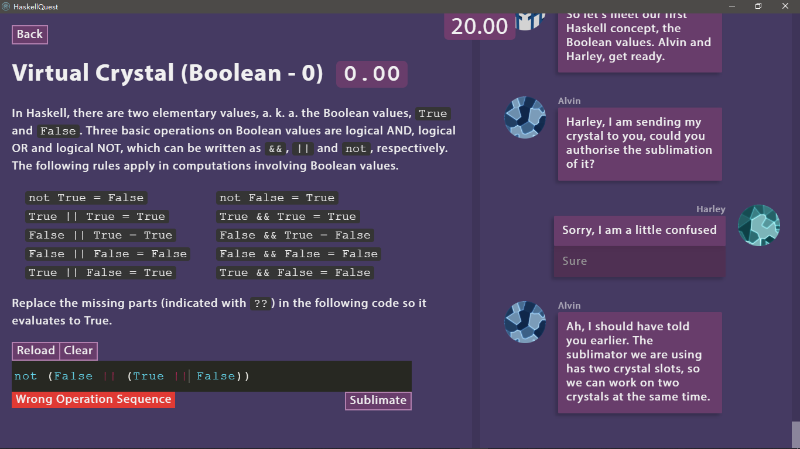
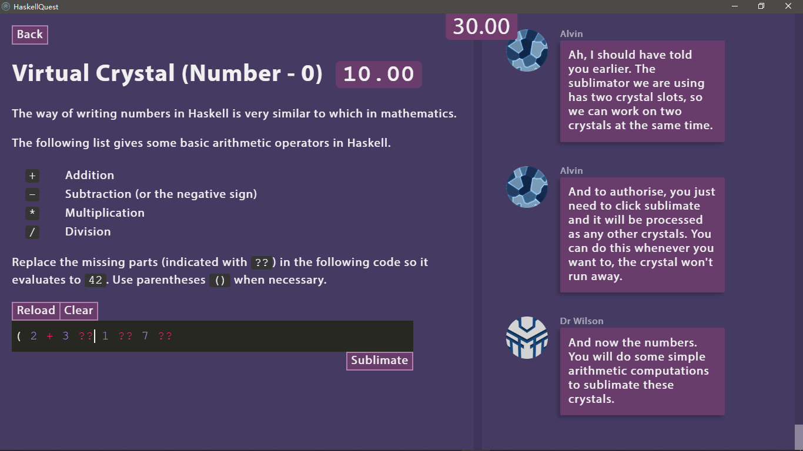
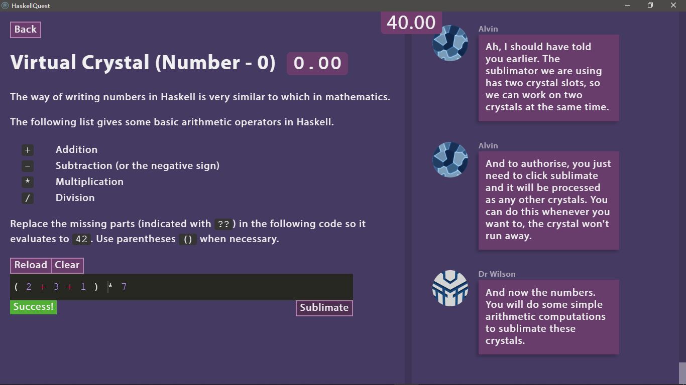

# HaskellQuest

### A game for teaching functional programming in Haskell

## Installation

### Windows

1. Install the Haskell Tool Stack

Please visit [the stack website](https://docs.haskellstack.org/en/stable/install_and_upgrade/#windows) and install stack according to the instructions on the webpage.

2. Install GHC and other libraries

- Run the following command.

  ```
  stack --version
  ```

  If no error occurs and the version of stack is correctly shown, the installation of stack was successful. If not, please try installing it again.

- Run the following commands sequentially to install [GHC](https://www.haskell.org/ghc/), [QuickCheck](http://hackage.haskell.org/package/QuickCheck) and [th-alpha](http://hackage.haskell.org/package/th-alpha).

  ```
  stack --resolver lts-9.17 setup
  stack update
  ghc-pkg recache
  stack install QuickCheck
  stack install th-alpha
  ```

  Some commands may take longer to complete, depending on the Internet condition and computer performance. The command screen may be flushed with massive progress information. If a command ends with a “Permission Denied” error, run it again. This step may take 20 ~ 30 minutes in total.

3. Start HaskellQuest

Please download HaskellQuestWindows.zip.

Unzip the downloaded file and you will get a folder named HaskellQuest.

Entering the HaskellQuest folder and double-clicking startHaskellQuest.bat will start the game. If the game does not start in 30 seconds, enter the win-unpacked folder and find a file named HaskellQuest.exe, double-clicking this file will start the game.

_For non-roman alphabets users, please switch to the English input method while playing HaskellQuest._

### macOS

Coming soon

## Screenshots

















## FAQ

1. `command not found` or `not recognized as an internal or external command, operable program or batch file` when run `ghc-pkg recache`.

   Solution: Skip this command.

2. The system already has another version of GHC installed, and the `stack install` command complains about the versions of dependencies.

   Solution: Try again with the following commands.

```
stack config set resolver lts-9.17
stack setup
stack update
stack install QuickCheck
stack install th-alpha
```
